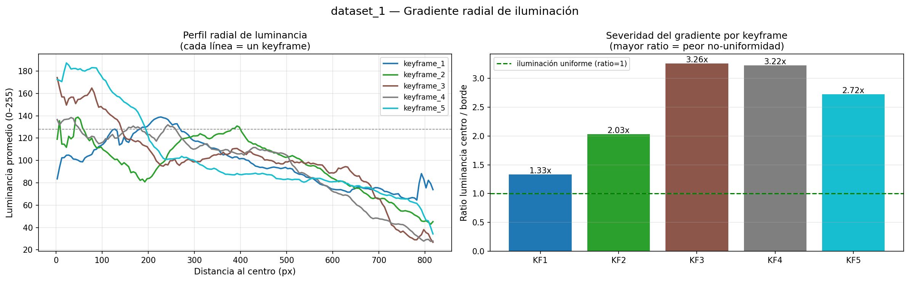
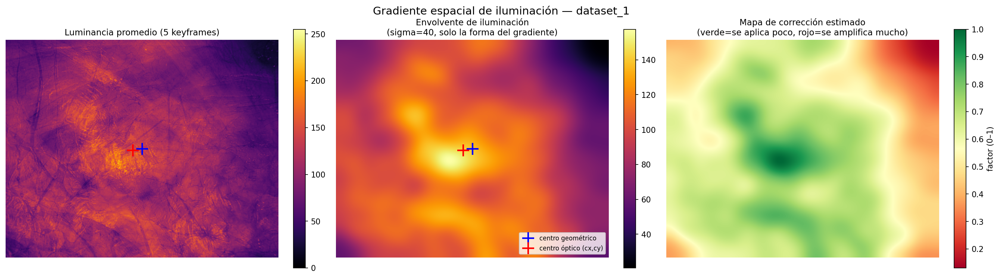
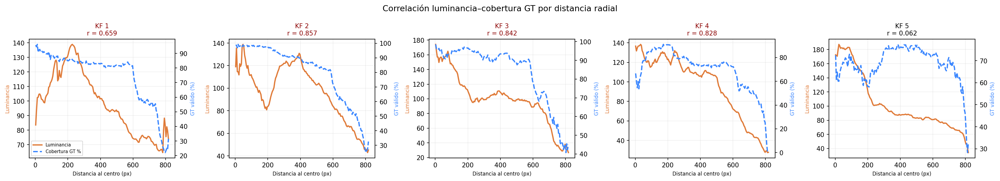
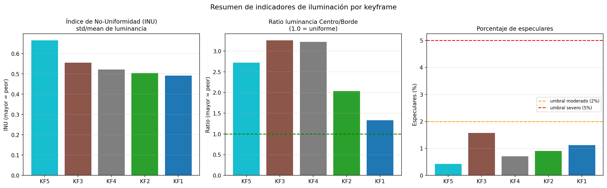
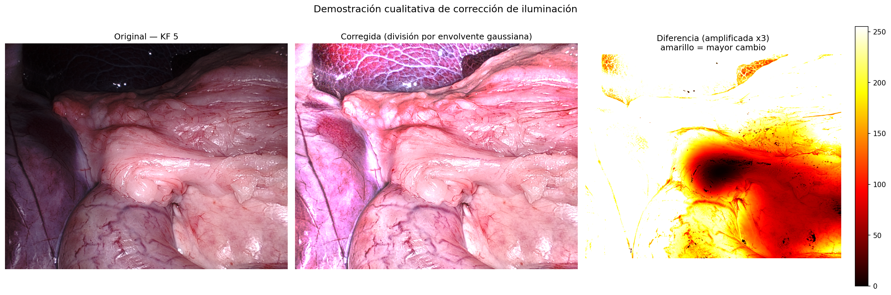

# Reporte EDA 01 — Iluminación no uniforme en endoscopía

**Notebook:** `notebooks/01_eda_iluminacion.ipynb`  
**Fecha de ejecución:** 2026-05-11  
**Dataset:** SCARED — `dataset_1`, keyframes 1 a 5  
**Autores:** Equipo 52 — Proyecto Integrador TC5035.10

---

## Introducción

El análisis exploratorio del notebook `00_exploracion_scared.ipynb` caracterizó la estructura física del dataset SCARED: qué archivos contiene cada keyframe, qué dimensiones tienen las imágenes, qué rangos de valores almacena el mapa de profundidad y cómo está calibrada la cámara. Ese análisis respondió la pregunta de qué hay en los datos y cómo leerlos.

Este notebook parte de ese conocimiento y hace una pregunta diferente: qué tan problemáticas son las imágenes RGB como entrada para un modelo de profundidad. La distinción importa porque un modelo no ve el dataset como una colección de archivos sino como una secuencia de píxeles con valores de intensidad. Si esos valores contienen un artefacto sistemático que no tiene relación con la escena, el modelo lo aprende como si fuera información real, y eso degrada su capacidad de generalizar.

El artefacto en cuestión es el gradiente de iluminación radial: el endoscopio lleva su fuente de luz coaxial al lente, lo que produce imágenes más brillantes en el centro y más oscuras hacia los bordes. Ese gradiente no es información del tejido. Es una propiedad del instrumento. El objetivo de este análisis es cuantificar su severidad, identificar en qué keyframes es más grave y establecer si existe una correlación entre ese gradiente y la pérdida de datos de ground truth, que es el argumento central que justifica una etapa de corrección antes del entrenamiento.

---

## 1. Perfil radial de luminancia

### Por qué se calcula

Antes de proponer cualquier corrección es necesario describir la forma del problema. El gradiente de iluminación podría ser uniforme en todos los keyframes o variar según el movimiento del endoscopio. Podría caer suavemente o de forma abrupta. Podría afectar por igual el centro y la periferia o concentrarse en los bordes.

La luminancia es la forma estándar de medir el brillo percibido en una imagen a color. No es simplemente el promedio de los tres canales RGB sino una combinación ponderada que reproduce la sensibilidad del ojo humano a cada color (formula ITU-R BT.601: `Y = 0.299*R + 0.587*G + 0.114*B`). Se usa en lugar del brillo bruto porque refleja mejor lo que el modelo "ve" al procesar la imagen.

El perfil radial convierte ese mapa 2D de luminancia en una curva 1D agrupando los píxeles por distancia al centro. Esto permite comparar keyframes de forma directa sin que las diferencias de contenido del tejido (que cambia entre keyframes) contaminen la comparación.

### Metodología

Para cada píxel de la imagen se calculó su distancia en píxeles al centro geométrico. El centro geométrico es simplemente el punto medio del sensor: con imágenes de 1280x1024 píxeles, ese punto es (640, 512), es decir, la mitad del ancho y la mitad del alto. No es una estimación ni un parámetro de calibración — es una propiedad de la resolución de la imagen. Los píxeles se agruparon en anillos de 5 píxeles de anchura y se promedió la luminancia de todos los píxeles dentro de cada anillo. El resultado es un perfil unidimensional que muestra cuánta luz recibe el sensor en función de la distancia al centro. Este procedimiento se repitió para los cinco keyframes de `dataset_1`.

### Resultados

La Figura 1 muestra los perfiles radiales de luminancia para los cinco keyframes. Todas las curvas comparten la misma forma: parten de valores altos en el centro (entre 140 y 180 unidades sobre una escala de 0 a 255) y descienden de forma continua hacia los bordes, donde llegan a valores de entre 40 y 80 unidades. La caída es gradual y no presenta discontinuidades, lo que confirma que el origen es óptico y no una variación del tejido.

**Figura 1.** Perfil radial de luminancia y ratio centro/borde por keyframe.



*Nota. Elaboración propia. Izquierda: perfil de luminancia promedio por distancia radial para los cinco keyframes de dataset_1. Derecha: ratio entre la luminancia del centro y la del borde de cada keyframe.*

La gráfica de barras de la derecha resume la severidad del gradiente mediante el ratio entre la luminancia promedio del centro y la del borde:

| Keyframe | Ratio centro/borde | Clasificación |
|---|---|---|
| KF1 | 1.33x | Leve |
| KF2 | 2.03x | Moderado |
| KF3 | 3.26x | Severo |
| KF4 | 3.22x | Severo |
| KF5 | 2.72x | Severo |

En KF3 y KF4 el centro es más de tres veces más brillante que el borde. Para un modelo de visión, esto equivale a recibir información de "textura" que en realidad representa casi en su totalidad la geometría del sistema óptico y no las propiedades del tejido. Si el modelo aprende esta correlación, no generalizará a condiciones distintas de iluminación.

---

## 2. Mapa 2D del gradiente de iluminación

### Por qué se calcula

El perfil radial de la sección anterior asume implícitamente que el gradiente es simétrico respecto al centro geométrico del sensor. Pero eso no tiene por qué ser cierto. La fuente de luz del endoscopio no apunta necesariamente al centro del sensor — está montada alrededor del lente, y pequeñas asimetrías en el montaje o la óptica desplazan el punto de máxima intensidad.

Para verificar si el gradiente es simétrico o no, y para saber dónde está realmente su máximo, es necesario ver el mapa 2D completo sin reducirlo a un perfil promedio. Ese mapa también es la entrada que necesitaría cualquier algoritmo de corrección: si sabemos dónde es la iluminación alta y dónde es baja, podemos estimar cuánto amplificar cada zona para uniformizar la imagen.

### Cómo se determinó el centro óptico

Las imágenes del dataset SCARED tienen resolución 1280x1024 píxeles. El centro geométrico del sensor es por definición el punto (640, 512): la mitad exacta del ancho y del alto. Ese punto no depende de calibración alguna.

El centro óptico, en cambio, es el punto de la imagen donde la proyección del eje óptico de la lente intersecta el plano del sensor. Es un parámetro de calibración que figura en el archivo `endoscope_calibration.yaml` de cada keyframe del dataset. Ese archivo almacena la matriz intrínseca de la cámara izquierda en formato OpenCV:

```
K = [[fx,  0, cx],
     [ 0, fy, cy],
     [ 0,  0,  1]]
```

Los valores leídos directamente de `dataset_1/keyframe_1/endoscope_calibration.yaml` son `cx = 597.0` y `cy = 520.4`. El desplazamiento respecto al centro geométrico es de 43 píxeles en horizontal y 8 píxeles en vertical. Este desplazamiento es esperado en lentes endoscópicos donde el montaje del sistema óptico raramente queda perfectamente centrado sobre el sensor.

### Metodología

Se calculó la luminancia promedio píxel a píxel entre los cinco keyframes. El resultado es un mapa que captura el patrón de iluminación estable a lo largo de la sesión, independientemente del movimiento del tejido. Promediar varios keyframes tiene una ventaja importante: el tejido cambia de posición entre captures, así que al promediar se cancela la contribución del tejido y queda solo lo que es constante, es decir, la iluminación del instrumento. Sobre ese promedio se aplicó un filtro gaussiano con desviación estándar de 40 píxeles para eliminar cualquier textura residual que el promedio no haya cancelado completamente, dejando únicamente la envolvente de baja frecuencia. El cociente entre el valor máximo de esa envolvente y cada píxel constituye el mapa de corrección estimado: indica cuánto habría que amplificar cada zona para igualarla al punto más brillante.

### Resultados

La Figura 2 presenta los tres mapas resultantes: el promedio bruto de luminancia, la envolvente suavizada y el mapa de corrección.

**Figura 2.** Mapa 2D del gradiente de iluminación y factor de corrección estimado.



*Nota. Elaboración propia. Izquierda: luminancia promedio entre los cinco keyframes. Centro: envolvente de iluminación suavizada (sigma=40). Derecha: mapa de corrección, donde el rojo indica zonas que requieren mayor amplificación.*

El manchon brillante en la imagen central no está centrado en el punto geométrico (640, 512), marcado con una cruz azul, sino desplazado hacia la zona superior derecha, próxima al centro óptico de la cámara izquierda (cx=597, cy=520), marcado con una cruz roja. La coincidencia entre el pico de luminancia y el centro óptico obtenido de la calibración confirma que el desplazamiento no es un artefacto del análisis sino una propiedad real del sistema óptico.

El mapa de corrección muestra que las zonas de los bordes inferiores requieren amplificarse entre 2x y 3x para igualar el brillo del centro. Una corrección radial simétrica no es suficiente porque el gradiente no es simétrico. Cualquier método que asuma que la fuente de luz está exactamente en el centro geométrico va a sub-corregir el lado izquierdo y sobre-corregir el derecho.

---

## 3. Especulares y cobertura de ground truth

### Por qué se calculan

Hasta aquí el análisis describió el gradiente como un problema continuo y suave. Pero hay un segundo fenómeno de iluminación que actúa de forma puntual y discreta: los reflejos especulares. Son manchas brillantes que aparecen cuando la superficie húmeda del tejido actúa como espejo y devuelve la luz del endoscopio directamente hacia el sensor sin dispersión. En esas zonas el sensor se satura y no registra información del tejido sino solo luz.

El motivo por el que esto importa para el proyecto es que el proyector de luz estructurada que genera el ground truth de profundidad tampoco puede triangular en esas zonas: la reflexión especular impide que el patrón de luz estructurada sea visible. El resultado es que los píxeles especulares no tienen profundidad en el archivo TIFF, y si el modelo intenta predecir profundidad en esas zonas, no tiene ninguna referencia contra la que compararse ni aprender.

Cuantificar cuántos especulares hay, dónde están y qué fracción de la pérdida de ground truth explican permite entender si el problema de datos faltantes es principalmente un problema de iluminación (que la corrección podría mitigar) o un problema estructural del tejido (que requiere otro tratamiento).

### Metodología

Se detectaron los reflejos especulares como píxeles donde los tres canales RGB superan simultáneamente el valor 240, cerca del máximo de 255. La condición de los tres canales simultáneamente es importante: un píxel con solo el canal rojo alto no es un especular sino tejido vascular muy rojo, que es normal en endoscopía. Un especular verdadero satura por igual los tres canales porque la reflexión especular no tiene color propio. Adicionalmente, se calculó la cobertura de ground truth como el porcentaje de píxeles con valor Z mayor a cero en el mapa TIFF. Finalmente, se midió el solapamiento entre la máscara de especulares y la máscara de píxeles sin GT para cuantificar en qué medida los especulares explican la pérdida de datos de profundidad.

### Resultados

La Figura 3 muestra las imágenes RGB con los especulares detectados en cian (fila superior) y las máscaras de cobertura de GT en verde y rojo (fila inferior).

**Figura 3.** Especulares detectados y cobertura de ground truth de profundidad por keyframe.


*Nota. Elaboración propia. Fila superior: imagen RGB con especulares detectados en cian (umbral R, G, B > 240). Fila inferior: máscara de cobertura de ground truth (verde = profundidad válida, rojo = sin medición).*

| Keyframe | Especulares (%) | Sin GT (%) | Solapamiento (%) |
|---|---|---|---|
| KF1 | 1.12 | 21.6 | 21.4 |
| KF2 | 0.91 | 17.0 | 8.7 |
| KF3 | 1.57 | 13.2 | 13.5 |
| KF4 | 0.71 | 27.0 | 14.6 |
| KF5 | 0.43 | 28.1 | 38.2 |

El porcentaje de especulares es bajo en todos los keyframes (entre 0.43% y 1.57%), pero la pérdida de ground truth es alta: entre el 13.2% y el 28.1% de los píxeles no tienen profundidad medida. El solapamiento variable entre ambas máscaras (de 8.7% en KF2 a 38.2% en KF5) indica que los especulares no son la causa principal de la pérdida de GT en este dataset. La mayor parte del GT faltante corresponde a zonas de curvatura extrema del tejido donde el ángulo de incidencia del proyector de luz estructurada es demasiado oblicuo para permitir triangulación, lo que no se refleja necesariamente en saturación visible de los canales RGB.

Para el proyecto esto significa que la corrección de iluminación no recuperará el GT perdido por curvatura, pero sí reducirá la confusión del modelo en las zonas donde sí hay GT disponible y la iluminación distorsiona la señal.

---

## 4. Correlación luminancia y cobertura de ground truth

### Por qué se calcula

Las secciones anteriores describen dos fenómenos por separado: el gradiente de iluminación y la pérdida de ground truth. Esta sección pregunta si ambos fenómenos están relacionados espacialmente. Si lo están, significa que la iluminación no solo distorsiona la señal visual sino que también predice dónde el modelo no va a tener datos para aprender. Eso convertiría el gradiente en un problema doble: introduce sesgo en las zonas donde sí hay GT, y concentra la ausencia de GT precisamente en las zonas de mayor sesgo.

El coeficiente de correlación de Pearson mide si dos variables suben y bajan juntas. Un valor cercano a -1 significa que cuando una sube, la otra baja, de forma sistemática. Aplicado a luminancia y cobertura de GT por distancia radial, un r cercano a -1 diría que las zonas más brillantes son las que menos GT tienen.

### Metodología

Utilizando los mismos anillos radiales de la Sección 1, se calculó en paralelo la luminancia promedio y el porcentaje de píxeles con GT válido para cada bin de distancia. Se obtuvieron dos curvas por keyframe y se calculó el coeficiente de correlación de Pearson entre ellas para cuantificar si las zonas más brillantes tienden a tener más o menos GT disponible.

### Resultados

La Figura 4 superpone las curvas de luminancia (naranja, eje izquierdo) y de cobertura de GT (azul discontinuo, eje derecho) para cada keyframe.

**Figura 4.** Correlación entre luminancia y cobertura de ground truth por distancia radial.



*Nota. Elaboración propia. Cada subgráfica muestra la luminancia promedio (naranja, eje izquierdo) y el porcentaje de píxeles con GT válido (azul, eje derecho) en función de la distancia al centro. El coeficiente r de Pearson se indica en el título de cada subgráfica.*

| Keyframe | Correlación de Pearson (r) |
|---|---|
| KF1 | -0.659 |
| KF2 | -0.857 |
| KF3 | -0.842 |
| KF4 | -0.828 |
| KF5 | -0.062 |

En cuatro de los cinco keyframes la correlación es negativa y moderada a fuerte. Esto significa que las zonas más brillantes de la imagen son, en promedio, exactamente las zonas con menos datos de ground truth disponibles. La curva de luminancia (naranja) sube mientras la de GT (azul) baja, y viceversa. El mecanismo es el siguiente: el gradiente de iluminación concentra el máximo de brillo en el centro, que es también la zona con mayor probabilidad de reflejos especulares por ser la más directamente iluminada; esos especulares impiden la triangulación del proyector de luz estructurada, generando los píxeles NaN en el TIFF.

KF5 es la excepción con r cercano a cero, lo que sugiere que en ese keyframe la posición del tejido o el ángulo de captura distribuyen la pérdida de GT de forma más uniforme a lo largo del radio, independientemente del gradiente.

Este es el hallazgo cuantitativo central del proyecto: si el gradiente de iluminación predice sistemáticamente dónde fallan los datos de entrenamiento, corregirlo reduce el sesgo espacial del modelo hacia las zonas brillantes del centro.

---

## 5. Coeficiente de variación de la luminancia

### Por qué se calcula

Los análisis anteriores producen múltiples métricas por keyframe: el perfil radial, el ratio centro/borde, el porcentaje de especulares, la correlación con el GT. Para comparar keyframes de forma rápida y para poder decir en el reporte final qué keyframe fue el más problemático, es útil tener un solo número que resuma el estado general de la iluminación.

El coeficiente de variación de la luminancia (CV) cumple ese rol. Es una medida estadística estándar definida como el cociente entre la desviación estándar y la media de una variable: `CV = std / mean`. Aplicado a la luminancia de una imagen, mide qué tan variable es la iluminación en relación a su nivel promedio. Un CV de 0 significa iluminación perfectamente plana. Cuanto más alto, más heterogénea es la imagen. Su ventaja sobre el ratio centro/borde es que no asume que el problema es radial: captura cualquier fuente de variabilidad espacial, incluyendo especulares, sombras o bordes oscuros (Gonzalez & Woods, 2018, cap. 3).

### Metodología

El CV de luminancia se calcula como `CV = std(luminancia) / mean(luminancia)`. Se calculó para cada keyframe junto con el ratio centro/borde de la Sección 1 y el porcentaje de especulares de la Sección 3, formando una tabla resumen de indicadores de calidad de iluminación ordenada de mayor a menor CV.

### Resultados

La Figura 5 presenta los tres indicadores como gráficas de barras ordenadas de mayor a menor INU.

**Figura 5.** Resumen de indicadores de iluminación por keyframe.



*Nota. Elaboración propia. Izquierda: coeficiente de variación de luminancia (CV = std/mean). Centro: ratio luminancia centro/borde. Derecha: porcentaje de especulares detectados. Barras ordenadas de mayor a menor CV.*

**Tabla 3.** Tabla resumen de indicadores de iluminación por keyframe, ordenada de mayor a menor CV.

| Keyframe | Lum. media | Lum. std | CV (std/mean) | Ratio C/B | Especulares (%) | GT válido (%) |
|---|---|---|---|---|---|---|
| KF5 | 93.2 | 61.9 | 0.665 | 2.72x | 0.43 | 71.9 |
| KF3 | 98.9 | 54.9 | 0.555 | 3.26x | 1.57 | 86.8 |
| KF4 | 97.4 | 50.7 | 0.521 | 3.22x | 0.71 | 73.0 |
| KF2 | 101.4 | 51.0 | 0.504 | 2.03x | 0.91 | 83.0 |
| KF1 | 97.6 | 48.0 | 0.492 | 1.33x | 1.12 | 78.4 |

KF5 encabeza el ranking con un CV de 0.665 a pesar de tener la luminancia media más baja (93.2) y el menor porcentaje de especulares (0.43%). Su alta variabilidad interna se debe a que contiene zonas muy oscuras en los bordes y zonas relativamente brillantes en el centro, con una diferencia que la desviación estándar de 61.9 refleja. KF3 y KF4 tienen los ratios C/B más extremos (3.26x y 3.22x) pero una desviación estándar algo menor, lo que los coloca en segundo y tercer lugar. KF1 es el keyframe con iluminación más regular, con un ratio de 1.33x y un CV de 0.492, aunque incluso ese valor está lejos de la uniformidad.

---

## 6. Demostración cualitativa de corrección

### Por qué se incluye

Hasta aquí el análisis describió el problema pero no propuso solución. Esta sección sirve para un propósito específico: demostrar que el problema es tratable con medios simples antes de invertir esfuerzo en métodos más complejos. Si una corrección básica no produce ninguna mejora visible, sería una señal de que el problema está mal planteado. Si produce mejora visible, justifica buscar métodos más sofisticados.

La corrección por división de envolvente es la más simple posible: se estima dónde hay más y menos luz, y se divide la imagen por ese mapa para nivelarla. No es el método definitivo del proyecto sino una prueba de concepto que establece una línea base cualitativa.

### Metodología

Se aplicó la corrección sobre KF5, el keyframe de mayor INU. Se estimó la envolvente de iluminación de ese keyframe específico aplicando un filtro gaussiano con desviación estándar de 60 píxeles sobre su luminancia, se normalizó al rango [0, 1] y se dividió cada canal RGB por esa envolvente. Los valores resultantes se recortaron al rango [0, 255]. Se calculó el INU antes y después de la corrección para tener una medida cuantitativa del cambio, además de la comparación visual.

### Resultados

La Figura 6 muestra la imagen original de KF5, la imagen corregida y el mapa de diferencias absolutas amplificado tres veces para facilitar la visualización.

**Figura 6.** Demostración cualitativa de corrección de iluminación sobre KF5.



*Nota. Elaboración propia. Izquierda: imagen original de KF5. Centro: imagen corregida por división de envolvente gaussiana (sigma=60). Derecha: diferencia absoluta amplificada por un factor de 3, donde el amarillo indica mayor cambio.*

La imagen corregida muestra que el tejido del borde inferior izquierdo, prácticamente negro en la original, recupera detalle y textura visible. Los cambios más grandes ocurren en los bordes (color amarillo en el mapa de diferencias), donde la envolvente era baja y la corrección más agresiva. El centro cambia poco porque ya era brillante y la envolvente es alta ahí.

El cambio de tonalidad hacia colores más fríos en la imagen corregida (más rosa y azul) es un artefacto de aplicar la corrección de forma independiente canal por canal: la envolvente estimada sobre la luminancia no corrige igual los tres canales RGB, lo que modifica el balance de color. Los métodos que se evaluarán en etapas posteriores del proyecto (CLAHE, Retinex, MonoIIF) abordan específicamente este problema aplicando la corrección de forma que preserve el balance de color y no amplifique el ruido del sensor en los bordes.

---

## 7. Resumen ejecutivo

El análisis sobre los cinco keyframes de `dataset_1` produce cinco hallazgos concretos con implicaciones directas para el diseño del pipeline de entrenamiento:

**Primero**, el gradiente radial de iluminación es sistemático y afecta a todos los keyframes sin excepción. El ratio entre la luminancia del centro y la del borde oscila entre 1.33x en el keyframe menos afectado y 3.26x en el más afectado. Un gradiente de esa magnitud introduce un sesgo estructural en cualquier modelo que aprenda directamente de estas imágenes.

**Segundo**, el gradiente no es simétrico. El manchon de máxima luminancia está desplazado hacia el centro óptico de la cámara (cx=597, cy=520), obtenido del archivo de calibración `endoscope_calibration.yaml`, y no hacia el centro geométrico del sensor (640, 512), que es simplemente la mitad de la resolución de la imagen. Esto invalida los métodos de corrección que asumen simetría radial y exige estimación explícita de la envolvente de iluminación.

**Tercero**, existe una correlación negativa fuerte entre luminancia y cobertura de ground truth en cuatro de los cinco keyframes (r entre -0.66 y -0.86). Las zonas más brillantes son las que más frecuentemente carecen de datos de profundidad válidos. Este hallazgo es el argumento cuantitativo principal para incluir una etapa de corrección antes del entrenamiento.

**Cuarto**, la pérdida de ground truth (13% a 28% según el keyframe) se explica solo parcialmente por los especulares detectados (0.43% a 1.57%). La curvatura del tejido contribuye con la mayor parte de la pérdida. La corrección de iluminación no recuperará ese GT faltante, pero sí reducirá el sesgo del modelo en las zonas donde sí hay GT disponible.

**Quinto**, una corrección simple por división de envolvente gaussiana es suficiente para demostrar que el problema es tratable, pero introduce distorsión de color y amplificación de ruido. Los métodos CLAHE, Retinex y MonoIIF son los candidatos a evaluar en la siguiente etapa del proyecto.

El keyframe más problemático según el CV es KF5 (CV=0.665, GT válido=71.9%) y es el candidato principal para los primeros experimentos de corrección. KF3 y KF4, con los ratios C/B más extremos (>3.2x), son complementos útiles para evaluar si la corrección reduce el error de profundidad bajo condiciones de gradiente severo.

---

## Referencias

| # | Referencia APA | Sección relevante |
|---|---|---|
| 1 | Allan, M., Mcleod, J., Wang, C., Rosenthal, J. C., Hu, Z., Gard, N., … Speidel, S. (2021). *Stereo correspondence and reconstruction of endoscopic data challenge*. arXiv:2101.01133. | Dataset SCARED, interpretación de NaN en depth maps |
| 2 | Gonzalez, R. C., & Woods, R. E. (2018). *Digital image processing* (4.ª ed.). Pearson. | Shading correction, INU, homomorphic filtering (caps. 3, 5, 6) |
| 3 | Land, E. H., & McCann, J. J. (1971). Lightness and Retinex theory. *Journal of the Optical Society of America*, *61*(1), 1–11. | Base teórica de la corrección por división de envolvente |
| 4 | Yu, B., Chen, W., Zhong, Q., & Zhang, H. (2021). Specular highlight detection based on color distribution for endoscopic images. *Frontiers in Physics*, *8*, 616930. https://doi.org/10.3389/fphy.2020.616930 | Criterio de detección de especulares (tres canales > umbral) |
| 5 | Stoyanov, D., Visentini Scarzanella, M., Pratt, P., & Yang, G.-Z. (2010). Real-time stereo reconstruction in robotically assisted minimally invasive surgery. En T. Jiang et al. (Eds.), *Medical Image Computing and Computer-Assisted Intervention – MICCAI 2010* (LNCS, vol. 6361, pp. 275–282). Springer. https://doi.org/10.1007/978-3-642-15705-9_34 | Gradiente radial como artefacto dominante en endoscopía |
| 6 | Cui, B., Islam, M., Bai, L., & Ren, H. (2024). Surgical-DINO: Adapter learning of foundation models for depth estimation in endoscopic surgery. *International Journal of Computer Assisted Radiology and Surgery*, *19*(6), 1013–1020. https://doi.org/10.1007/s11548-024-03083-5 | Motivación del proyecto: corrección de iluminación mejora depth |

---

*Reporte generado a partir de los outputs de `notebooks/01_eda_iluminacion.ipynb`. Imágenes en `outcomes/eda_outputs/`.*
