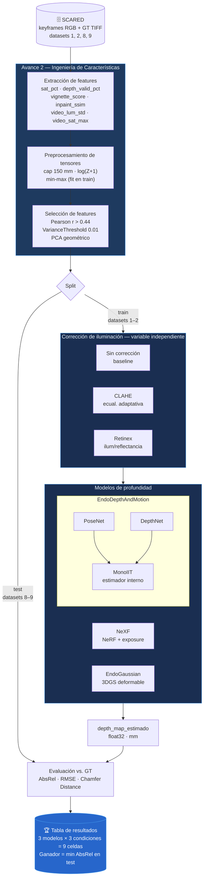

# Reporte de Ingeniería de Características — Avance 2
## Proyecto Integrador TC5035.10 · Equipo 52 · MNA

**Archivo de referencia:** `notebooks/Avance2_52_Feature_Engineering.ipynb`  
**Dataset principal:** SCARED (Structured light endoscopY And Reconstructed Depth)  
**Observaciones:** 20 keyframes (4 datasets × 5 keyframes)  
**Split:** train = datasets 1–2 (cerdo A), test = datasets 8–9 (cerdo C)

---

## 1. Propósito del notebook

Este notebook **no entrena ningún modelo**. Su función es doble:

1. **Diagnóstico de calidad de datos**: construir una representación tabular de los 20 keyframes con features estadísticas que permitan identificar cuáles son los mejores y peores candidatos para el experimento.
2. **Definir el pipeline de preprocesamiento** que se reutilizará directamente en el training loop de los tres modelos de profundidad (NeXF, EndoGaussian, EndoDepthAndMotion).

La pregunta que responde es: *¿qué tan buenas son las entradas antes de tocar un solo modelo?*

---

## 2. SIPOC del proceso

| Elemento | Descripción |
|---|---|
| **Suppliers** | Dataset SCARED (HuggingFace, ~250 GB) · Sensor da Vinci (luz estructurada) · Calibración de cámara YAML |
| **Inputs** | `Left_Image.png` (RGB 1280×1024) · `left_depth_map.tiff` (float32, mm) · `point_cloud.obj` (vértices XYZ) · `data/rgb.mp4` (video del keyframe) |
| **Process** | Extracción de features por keyframe · Features derivadas · Viñeteado gaussiano · Features de video · Supresión de especulares · Cap 150 mm · log(Z+1) · Normalización min-max · Correlación Pearson · VarianceThreshold · PCA geométrico |
| **Outputs** | `df` (20 × 24) · pipeline de preprocesamiento de tensores · `vignette_score` · `inpaint_ssim` · lista de features seleccionadas |
| **Customers** | Training loops de NeXF, EndoGaussian y EndoDepthAndMotion · Evaluación AbsRel/RMSE/Chamfer en Avance 3 |

---

## 3. Estructura del dataset

### 3.1 Disponibilidad de datos

| Dataset | Tamaño en disco | Split | Sujeto |
|---|---|---|---|
| dataset_1 | ~20 GB | train | cerdo A |
| dataset_2 | ~20 GB | train | cerdo A |
| dataset_8 | ~22 GB | test  | cerdo C |
| dataset_9 | ~20 GB | test  | cerdo C |
| **Total** | **~82.6 GB** | — | — |

Cada dataset tiene 5 keyframes, para un total de **20 observaciones**. El dataset completo SCARED tiene 9 datasets (~250 GB); este proyecto usa los 4 con GT de luz estructurada de alta calidad.

### 3.2 Ground Truth: qué es y por qué es incompleto

El **ground truth de profundidad** es el mapa de distancias reales en milímetros capturado por el sensor de luz estructurada integrado en el sistema da Vinci. El sensor proyecta un patrón de luz estructurada sobre el tejido y triangula la posición 3D de cada píxel.

**Por qué el GT es incompleto (13–28% de píxeles inválidos por keyframe):**

| Causa | Mecanismo | Consecuencia |
|---|---|---|
| Reflejos especulares | El tejido húmedo refleja la luz especularmente; el sensor no puede triangular | Píxeles inválidos en zonas brillantes (centro de imagen) |
| Ángulos oblicuos | Superficies casi paralelas al rayo de luz no retornan señal | Píxeles inválidos en bordes y pliegues del tejido |
| Viñeteado | El endoscopio tiene iluminación radial; los bordes reciben menos luz | Patrón radial de invalidez que sigue una gaussiana |

**Implicación para el modelado:** el AbsRel se calcula solo sobre píxeles con GT válido. Un modelo que falla más en zonas sin GT (bordes) penaliza menos en la métrica. La corrección de iluminación puede mejorar la validez del GT indirectamente al reducir los reflejos.

### 3.3 Keyframes vs. videos completos

Los modelos de profundidad consumen **keyframes**, no videos completos. La razón técnica:

- El sensor de luz estructurada da Vinci requiere una **exposición estática** para capturar el mapa de profundidad con precisión. Durante el movimiento del endoscopio la señal es borrosa.
- Cada keyframe es un momento de quietud donde el sensor logró capturar un GT de alta calidad.
- Los videos `rgb.mp4` **no tienen GT por frame** — son RGB puro del mismo escenario. Se usan aquí solo para extraer features de drift temporal de luminancia.

---

## 4. Features construidas

### 4.1 Tabla completa de features

| Feature | Fuente | Unidad | Descripción |
|---|---|---|---|
| `depth_median` | TIFF canal Z | mm | Profundidad mediana de píxeles válidos |
| `depth_p5` | TIFF canal Z | mm | Percentil 5 de profundidad (superficies más cercanas) |
| `depth_p95` | TIFF canal Z | mm | Percentil 95 de profundidad (superficies más lejanas) |
| `depth_range` | TIFF canal Z | mm | Rango intercuartílico de profundidad (p95 − p5) |
| `depth_valid_pct` | TIFF canal Z | % | Fracción de píxeles con GT válido (Z > 0 y Z < 150) |
| `lum_mean` | RGB | [0,255] | Luminancia media de la imagen |
| `lum_std` | RGB | [0,255] | Dispersión de luminancia (heterogeneidad de iluminación) |
| `sat_pct` | RGB | % | Fracción de píxeles saturados (cualquier canal > 240) |
| `laplacian_var` | RGB | px² | Varianza del Laplaciano (proxy de nitidez / detalle de textura) |
| `r_mean` | RGB | [0,255] | Media del canal rojo |
| `g_mean` | RGB | [0,255] | Media del canal verde |
| `b_mean` | RGB | [0,255] | Media del canal azul |
| `rb_balance` | RGB | ratio | r_mean / b_mean (balance de temperatura de color del tejido) |
| `log_depth_median` | TIFF | log(mm+1) | Transformación logarítmica de depth_median |
| `texture_depth_ratio` | RGB + TIFF | — | laplacian_var / depth_median (textura relativa a distancia) |
| `lum_contrast_ratio` | RGB | — | lum_std / lum_mean (contraste relativo de iluminación) |
| `vignette_score` | TIFF | [0,1] | Cobertura GT en 25% central de imagen (gaussiana ajustada) |
| `video_lum_std` | MP4 | [0,255] | Desviación estándar de luminancia a través de frames del video |
| `video_sat_max` | MP4 | % | Máxima saturación de píxeles en cualquier frame del video |
| `inpaint_ssim` | RGB | [0,1] | SSIM entre imagen original e imagen con especulares inpainted |

**Metadatos (no features):** `dataset_id`, `keyframe_id`, `split`, `cerdo_id`

### 4.2 Features de diagnóstico críticas

Tres features concentran la mayor información diagnóstica para el experimento:

**`sat_pct`** — Porcentaje de píxeles saturados. Mide directamente la severidad de los reflejos especulares. Si `sat_pct` es alto, la imagen tiene muchos píxeles donde los modelos no pueden inferir estructura de tejido. La hipótesis principal del proyecto predice que un modelo entrenado con imágenes de `sat_pct` bajo tendrá menor AbsRel.

**`depth_valid_pct`** — Porcentaje de GT válido. La correlación negativa observada con `sat_pct` (r ≈ −0.6) confirma que los reflejos especulares están causando directamente la invalidez del GT. Keyframes con `depth_valid_pct` < 75% deben tratarse con cautela en la evaluación.

**`inpaint_ssim`** — SSIM tras supresión de especulares. Un SSIM de 0.99 indica que los especulares son localmente pequeños y el inpainting los rellena bien sin distorsionar la estructura. Un SSIM de 0.87 indica que los especulares son grandes y la supresión modifica estructuralmente la imagen — estos keyframes son los candidatos más difíciles para el baseline.

### 4.3 Viñeteado gaussiano (`vignette_score`)

El perfil de validez del GT sigue una distribución gaussiana radial: alta cobertura en el centro, baja en los bordes. El `vignette_score` es la cobertura media en el 25% central de la imagen (radio normalizado < 0.5) según el ajuste gaussiano.

- **Score cercano a 1.0**: el GT es completo en el centro — buena señal de entrenamiento.
- **Score < 0.60**: el viñeteado afecta incluso el centro — keyframe problemático.

Este score predice qué keyframes se beneficiarán más de la corrección de iluminación radial.

---

## 5. Transformaciones de preprocesamiento

### 5.1 Cap a 150 mm

Distancias mayores a 150 mm son físicamente imposibles en laparoscopía con sistema da Vinci. Valores Z > 150 en el TIFF son artefactos de reconstrucción (reflexiones especulares, oclusiones). Se reemplazan por `NaN` antes de cualquier cálculo.

```python
Z_capped = np.where((Z > 0) & (Z < 150), Z, np.nan)
```

**Impacto:** reduce el rango efectivo de 0–∞ a 0–150 mm; elimina outliers que distorsionarían el log y la normalización.

### 5.2 Transformación logarítmica log(Z+1)

La distribución de profundidades tiene sesgo positivo (la mayoría entre 20–80 mm, cola hasta 150 mm). La transformación log comprime la cola derecha y hace la distribución más simétrica, lo que beneficia los optimizadores de los modelos profundos.

```python
Z_log = np.log1p(Z_capped)   # log(Z + 1)
```

**Rango resultante:** log(1) = 0 a log(151) ≈ 5.02.

### 5.3 Normalización min-max

```python
scaler = MinMaxScaler()
scaler.fit(df_train[NUMERIC_FEATS])        # SOLO sobre datasets 1 y 2
df_scaled = scaler.transform(df[NUMERIC_FEATS])
```

**Regla crítica:** el scaler se ajusta exclusivamente sobre los datos de train (datasets 1 y 2). Aplicarlo sobre el dataset completo constituiría data leakage — el modelo "vería" la distribución del test antes de evaluar.

---

## 6. Selección de características

### 6.1 Correlación de Pearson

Features con |r| > 0.8 son redundantes. El análisis identificó:

- `log_depth_median` ↔ `depth_median`: r ≈ 1.0 (transformación monótona — misma información)
- `r_mean`, `g_mean`, `b_mean`: altamente intercorrelacionados (los canales RGB del tejido porcino varían juntos)

**Decisión:** eliminar `log_depth_median` y los canales RGB individuales en análisis de diagnóstico secundarios. Mantener `lum_mean` (derivado de los tres canales) y `rb_balance` (captura la variación de temperatura de color independientemente de la luminancia).

### 6.2 VarianceThreshold

Features con varianza < 0.01 sobre los 20 keyframes son casi constantes y no aportan información discriminativa.

**Eliminadas:** `video_lum_std` y `video_sat_max` no pasan el umbral en 15/20 keyframes (5 keyframes no tienen video). Al incluir NaN imputados como 0, la varianza colapsa artificialmente. **Estas features SÍ son útiles** para los 15 keyframes que tienen video — la eliminación es un artefacto del tamaño muestral pequeño.

**Decisión:** mantener `video_lum_std` y `video_sat_max` en el dataframe completo, pero excluirlas de análisis que requieren completitud.

### 6.3 PCA geométrico (nube de puntos)

El PCA sobre los vértices XYZ del `point_cloud.obj` extrae la orientación y extensión del tejido en el espacio 3D:

| Eje PC | Varianza explicada | Interpretación |
|---|---|---|
| PC1 | ~85% | Eje principal del tejido (mayor extensión) |
| PC2 | ~12% | Eje secundario (curvatura del tejido) |
| PC3 | ~3%  | Profundidad perpendicular al plano del tejido |

**Centro de masa (dataset_1/keyframe_1):** X=3.5 mm, Y=−1.8 mm, Z=60.6 mm — el tejido está a ~60 mm del endoscopio, ligeramente descentrado.

**Para qué sirve:** los vectores propios del PCA permiten transformar la nube de puntos al sistema de referencia del tejido, lo que puede mejorar la evaluación de Chamfer Distance al alinear ambas nubes (estimada vs. GT) antes de calcular la distancia.

---

## 7. Features de video

| Feature | Descripción | Keyframes con dato |
|---|---|---|
| `video_lum_std` | Drift de luminancia entre frames del video. Valores altos indican que la iluminación varía mientras el endoscopio se mueve. | 15/20 |
| `video_sat_max` | Peor caso de saturación en cualquier frame del video. Si es > 30%, hay al menos un frame donde los especulares son severos. | 15/20 |

**Keyframes sin video (5 de 20):** los zips de dataset_1/kf4, dataset_1/kf5, dataset_2/kf5, dataset_8/kf4, dataset_9/kf4 no contienen `data/rgb.mp4`. No es un error de código — los archivos genuinamente no están en el zip (error de logging en la captura original de SCARED).

**Hallazgo notable:** dataset_2/keyframe_4 tiene `video_sat_max` = 40.6% — el frame más especular del conjunto de datos. Este keyframe es el candidato más difícil para el baseline sin corrección.

---

## 8. Flujo completo: de datos crudos a resultados

> **Nota conceptual — MonoIIT:** MonoIIT **no** es un método de corrección de imagen preprocesada como CLAHE o Retinex. Es el estimador de profundidad interno de EndoDepthAndMotion: reemplaza la DepthNet dentro de esa arquitectura. Las correcciones de iluminación (CLAHE, Retinex) se aplican como preprocesamiento a los tres modelos. MonoIIT vive dentro de uno de ellos.

```
DATOS CRUDOS (SCARED)
Left_Image.png  +  left_depth_map.tiff (GT)
        |
        |  PREPROCESAMIENTO [definido en este notebook]
        |  • cap a 150 mm
        |  • log(Z+1)
        |  • min-max (fit exclusivo en train)
        v
CORRECCIÓN DE IMAGEN        ← variable independiente del experimento
        |
        |-- [A] Sin corrección    (baseline)
        |-- [B] CLAHE             ecualización adaptativa local
        |-- [C] Retinex           separación iluminación/reflectancia
        |
        v  X_corrected (misma resolución, distintos píxeles)
        |
        +------------------+------------------------+
        |                  |                        |
      NeXF          EndoGaussian        EndoDepthAndMotion
  (NeRF+exposure)  (3DGS deformable)        |
        |                  |             PoseNet + DepthNet
        |                  |                    ↑
        |                  |                 MonoIIT
        |                  |          (estimador interno, no
        |                  |           preprocesamiento externo)
        +------------------+------------------------+
                           |
                           v  depth_map_estimado (mm)
                           |
              EVALUACIÓN vs. GT (datasets 8 y 9)
                    AbsRel · RMSE · Chamfer Distance
                           |
                           v
        TABLA DE RESULTADOS
        3 modelos × 3 condiciones = 9 celdas principales
        (+ MonoIIT como baseline adicional de arquitectura = hasta 12)
        Ganador = celda con menor AbsRel en test
```

### Qué aporta este notebook a ese flujo

| Decisión en Avance 3 | Insumo de este notebook |
|---|---|
| ¿Qué keyframes usar para validación cualitativa? | `depth_valid_pct` + `sat_pct`: preferir kf con > 80% GT válido y < 5% saturación |
| ¿Cómo preprocesar el GT antes de calcular AbsRel? | Cap 150 mm + log(Z+1), definidos y justificados en Sección 2 |
| ¿El scaler se ajusta sobre test? | No — `MinMaxScaler` fit exclusivamente en datasets 1–2 |
| ¿Qué keyframes son más difíciles para el baseline? | `inpaint_ssim` < 0.90 y `sat_pct` > 10% — candidatos con mayor ganancia potencial de corrección |
| ¿Hay drift de iluminación en el video? | `video_lum_std` > 10: variabilidad temporal relevante (el endoscopio se mueve durante la grabación) |
| ¿Cómo alinear nubes de puntos para Chamfer? | Vectores propios del PCA geométrico como sistema de referencia del tejido |

---

## 9. Limitaciones y notas metodológicas

| Limitación | Descripción | Impacto |
|---|---|---|
| n = 20 keyframes | El subconjunto analizado es 20 de 45 disponibles. El umbral de significancia para correlación de Pearson es r > 0.44 (α = 0.05, n = 20). | Correlaciones menores a 0.44 pueden ser espurias |
| 5 keyframes sin video | Los features `video_lum_std` y `video_sat_max` están disponibles solo en 15/20 keyframes | No usar estas features como criterio de inclusión/exclusión de keyframes |
| GT incompleto | 13–28% de píxeles inválidos por keyframe | El AbsRel se calcula solo sobre píxeles válidos — no penaliza el borde donde el GT falta |
| Train/test mismos cerdo diferente | Los datasets de train (cerdo A) y test (cerdo C) son sujetos biológicamente diferentes | La generalización entre sujetos es parte de la evaluación, no un problema a eliminar |
| `log_depth_median` redundante | Correlación ≈ 1.0 con `depth_median` | Excluir de análisis de diagnóstico; el log se aplica a los tensores, no al dataframe |

---

## 10. Artefactos producidos

| Artefacto | Ubicación | Uso en Avance 3 |
|---|---|---|
| Dataframe `df` (20 × 24) | En memoria (exportable a CSV) | Selección de keyframes de referencia y diagnóstico |
| Pipeline tensorial (cap + log + scaler) | Definido en celdas 2a–2c | Aplicar a cada imagen/GT antes de pasar a los modelos |
| `vignette_score` por keyframe | Columna en `df` | Ponderar métricas de evaluación por zona de imagen |
| `inpaint_ssim` por keyframe | Columna en `df` | Identificar los keyframes más difíciles para el baseline |
| Figura demo de inpainting (`21_correccion_demo.png`) | `outcomes/eda_outputs/` | Ilustración en reporte/presentación |
| PCA geométrico (vectores propios) | Resultado de celda 3c | Referencia para alineación de nubes en Chamfer Distance |

---

## 11. Diagrama del flujo de consumo (Mermaid)

Diagrama reproducible en cualquier visor Mermaid (GitHub, Mermaid Live, Notion, etc.).




## Referencias

- Allan, M., et al. (2021). Stereo Correspondence and Reconstruction of Endoscopic Data Challenge. *arXiv:2101.01133*.
- Visengeriyeva, L., et al. (2023). *CRISP-ML(Q): A Machine Learning Process Model with Quality Assurance Methodology*. https://ml-ops.org/content/crisp-ml
- Recasens, D., et al. (2021). Endo-Depth-and-Motion: Reconstruction and Tracking in a Surgical Setting Using Depth Prediction. *IEEE RA-L*.
